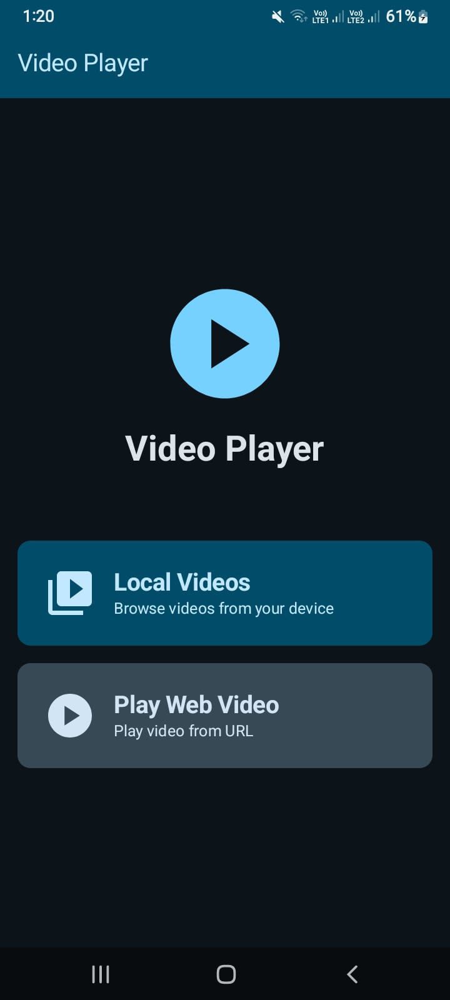
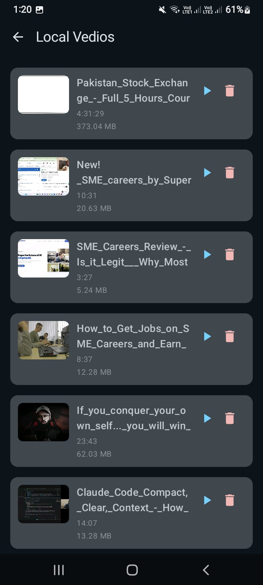
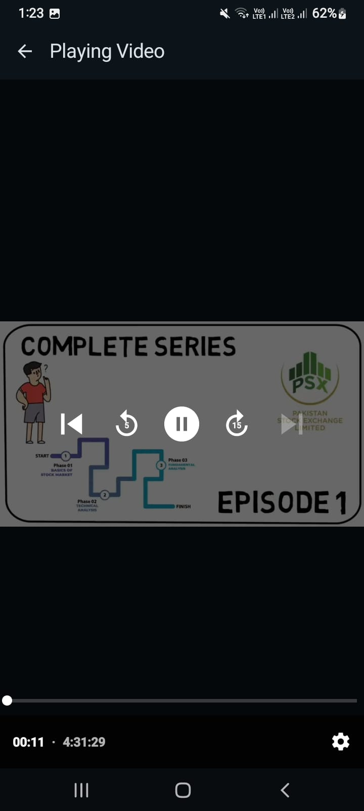
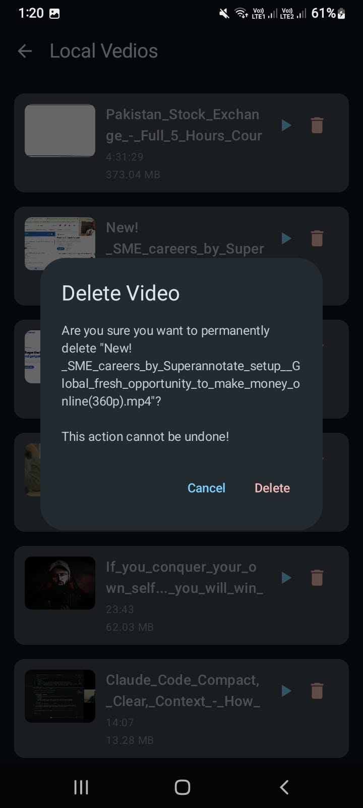
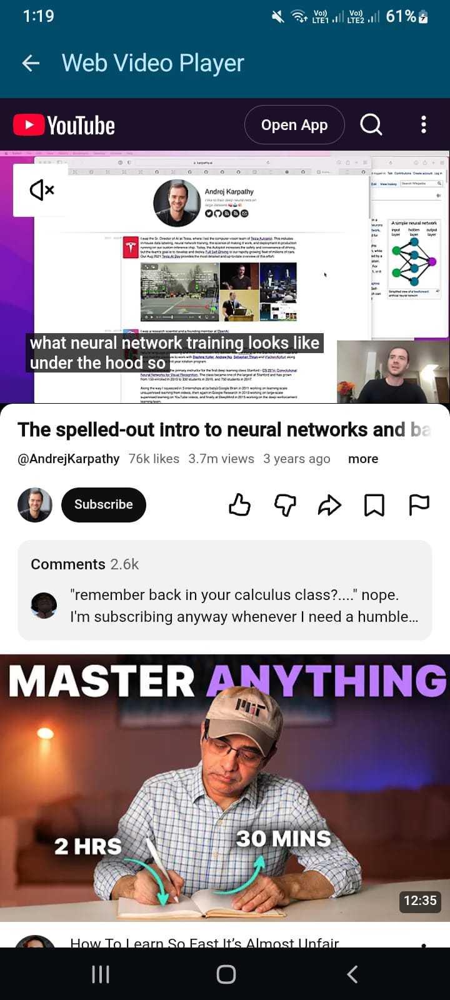
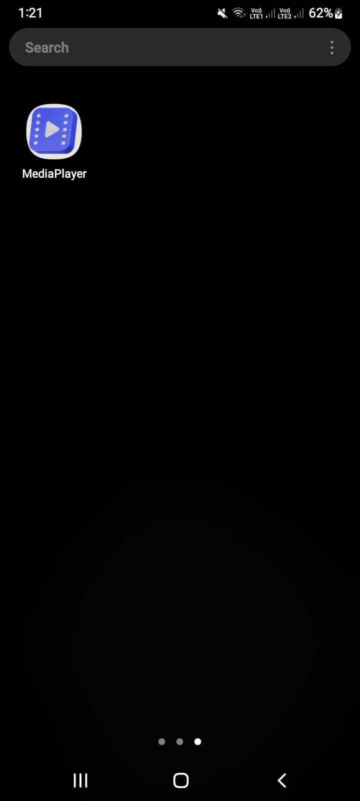

# 🎬 Media Player App

A high-performance, modern Android Media Player built with **Jetpack Compose**. This app allows users to browse local videos from their device, play them using **ExoPlayer**, delete unwanted videos, and even play videos directly from web URLs.

---

## 🚀 Features

*   🔍 **Local Video Discovery**: Automatically scans your phone for video files.
*   🖼️ **Auto-Thumbnails**: Generates preview images for every video in your list.
*   🎥 **Smooth Playback**: Uses Google's **Media3 ExoPlayer** for high-quality video streaming.
*   🌐 **Web Player**: Integrated WebView to play videos from the internet.
*   🗑️ **Safe Deletion**: Delete videos with a confirmation dialog and modern Android permission handling.
*   📱 **Responsive Design**: Adapts perfectly to screen rotations and different device sizes.

---

## 🛠 Tech Stack (Modern Technologies)

*   **Language**: Kotlin (100%)
*   **UI**: Jetpack Compose (Declarative UI)
*   **Architecture**: MVVM (Model-View-ViewModel)
*   **Navigation**: Type-Safe Compose Navigation
*   **Media**: AndroidX Media3 (ExoPlayer)
*   **Async**: Kotlin Coroutines & Flow
*   **Permissions**: Google Accompanist Permissions
*   **Formatting**: MediaStore API for local storage access

---

## 📁 Project Structure

```text
com.example.mediaplayer
├── domain
│   ├── repository    # Data fetching logic (VedioRepository.kt)
│   └── util          # Helper tools (DurationFormatUtility.kt)
├── models            # Data (DataModel.kt)
├── navigation        # App "Traffic Police" (Routes.kt, NavGraph.kt)
├── presentation
│   ├── viewmodel     # Data storage for UI (VedioViewModel.kt)
│   ├── localvedios   # List screens (LocalVediosScreen.kt, VedioItems.kt)
│   └── player        # Player screens (LocalPlayerScreen.kt, WebPlayerScreen.kt)
└── MainActivity.kt   # Entry point of the app
```

---

## 🖼️ Screenshots

<p align="center">
 
  
  
  
  
</p>

<p align="center">
  
  
</p>

---

## 🌊 1. Data Flow (How the code works)

Think of the app like a restaurant:

1.  **The Pantry (Data/MediaStore)**: This is where the raw videos are stored in your phone's memory.
2.  **The Chef (Repository)**: `VedioRepository` goes into the pantry, finds all the videos, and puts them into a nice "List" (`LocalVedio` objects).
3.  **The Waiter (ViewModel)**: `VedioViewModel` takes that list from the Chef and keeps it ready. If the customer (User) rotates the phone, the Waiter doesn't drop the tray!
4.  **The Menu (Navigation)**: `NavGraph` decides which page the user sees. If a user picks a dish (Video), the menu tells the app to go to the "Player Page".
5.  **The Table (UI)**: `LocalVediosScreen` and `LocalPlayerScreen` are what the user actually sees and interacts with.

---

## 👶 2. Key Concepts (Beginner Friendly)

*   **`@Serializable`**: Imagine you have a Lego house. You can't fit it through a small mail slot. You have to "serialize" it (take it apart and put instructions in a box). The other side "deserializes" it (builds it back). We use this to send data between screens.
*   **`suspend`**: This is like saying, *"Wait for me!"*. If we search for 1000 videos, the app might freeze. A `suspend` function does the work in the background so the app stays smooth.
*   **`Composable`**: These are like building blocks. You make a small block for a "Play Button", another for a "Video Card", and then stack them together to make a full screen.
*   **`Uri`**: This is the "Home Address" of a file. Just like your house has an address, every video on your phone has a unique URI so the app can find it.
*   **`Long`**: This is just a very big number. Since phones can have thousands of videos, we use `Long` for IDs instead of small numbers.

---

## 🧬 3. Parameter & Argument Flow (The Journey of Data)

Let's follow the **`vedioId`** to see how it moves through the files:

1.  **`LocalVedio` (The Identity)**: 
    *   Every video has a unique `id` (e.g., `12345`). This is stored in `DataModel.kt`.

2.  **`VedioItems.kt` (The Click)**:
    *   Inside the list, you click a video. The code calls `onClick()`.
    *   *Where it goes:* It sends the `video.id` to the `LocalVediosScreen`.

3.  **`LocalVediosScreen.kt` (The Navigation Call)**:
    *   It receives the ID and tells the "Traffic Police" (NavController): 
    *   `navController.navigate(Routes.LocalPlayer(vedioId = video.id))`

4.  **`NavGraph.kt` (The Hand-off)**:
    *   The `NavGraph` catches this ID: `val args = backStackEntry.toRoute<Routes.LocalPlayer>()`.
    *   It then hands this ID to the next screen: `LocalPlayerScreen(navController, args.vedioId, viewModel)`.

5.  **`LocalPlayerScreen.kt` (The Playback)**:
    *   The screen takes `vedioId`. 
    *   It asks the ViewModel: *"Hey, give me the full address (URI) for ID 12345"*.
    *   `val videoUri = viewModel.getVideoUri(vedioId)`
    *   Finally, **ExoPlayer** takes that URI and starts playing your video!

---

## 📜 4. File-by-File Explanation

*   **`MainActivity.kt`**: The boss of the app. It creates the Repository and ViewModel and starts the Navigation.
*   **`VedioRepository.kt`**: Talker. It talks to the Android System to get the list of videos and handles deleting files.
*   **`VedioViewModel.kt`**: Memory. It holds the `localVedios` list and the `isLoading` state (to show a spinner while loading).
*   **`DurationFormatUtility.kt`**: Decorator. It changes ugly numbers like `5000` into `00:05` (5 seconds) and `1048576` bytes into `1.00 MB`.
*   **`VedioItems.kt`**: The "Card". It defines how one single video row looks (Thumbnail, Title, Size, Delete button).
*   **`LocalPlayerScreen.kt`**: The Theatre. It hosts the **ExoPlayer** to show the actual moving video.
*   **`Routes.kt`**: The Map. It lists all the possible destinations in the app.

