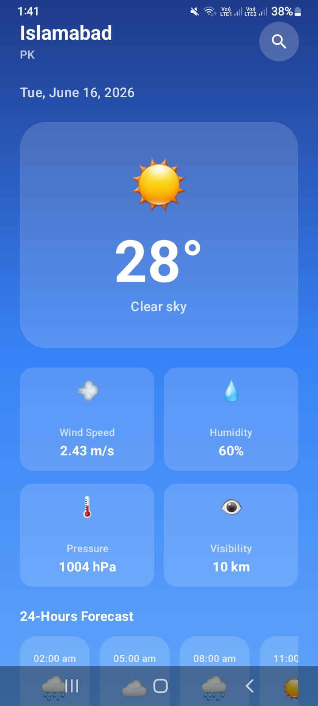
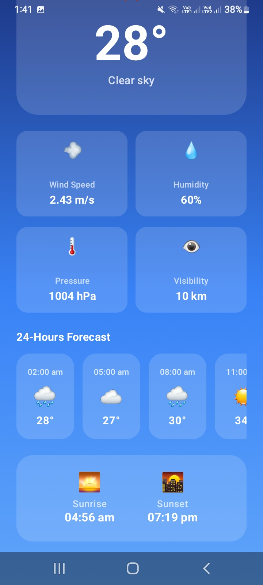
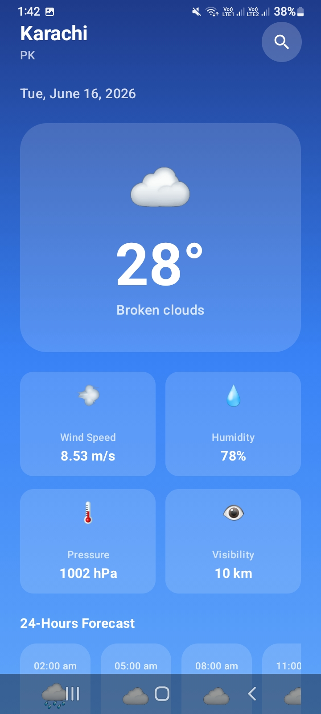
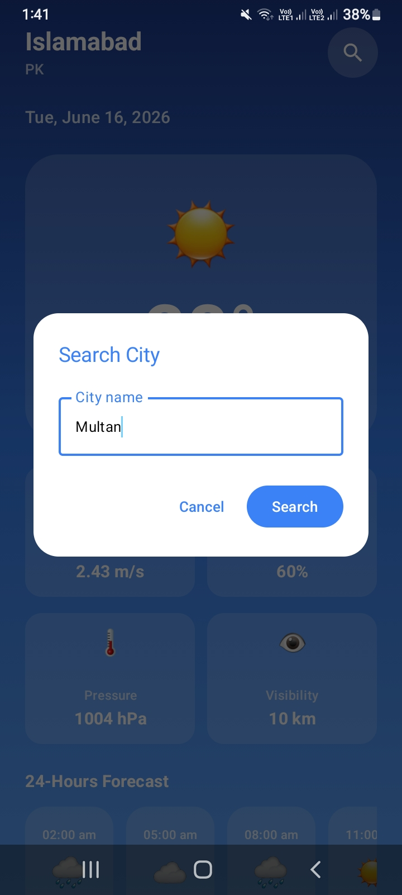

# 🌤️ WeatherApp - Modern Weather Forecasting

Welcome to **WeatherApp**, a sleek and powerful Android application designed to provide real-time weather updates and accurate forecasts with a modern user experience. Built using the latest Android development standards, this project demonstrates a clean architecture approach combined with beautiful UI design.

---

## 🚀 Overview

**WeatherApp** allows users to stay informed about weather conditions in any city. It provides comprehensive data including temperature, humidity, wind speed, pressure, and sunset/sunrise times. Additionally, it offers a 3-hourly forecast to help users plan their day effectively.

### ✨ Key Features
- **Real-time Weather**: Get instant updates on current weather conditions for any location.
- **Detailed Forecast**: View a 3-hourly weather forecast for the next 24 hours.
- **City Search**: Easily search for weather information in different cities worldwide.
- **Rich Weather Details**: Monitor humidity, wind speed, atmospheric pressure, and more.
- **Visual Sun Times**: Beautiful cards showing Sunrise and Sunset times.
- **Modern UI**: A responsive and visually appealing interface with smooth gradients and modern cards.
- **Robust Error Handling**: Graceful loading states and error screens for a seamless experience.

---

## 🛠️ Tech Stack & Modern Technologies

This project leverages the **modern Android development toolkit** to ensure scalability, maintainability, and high performance.

- **[Kotlin](https://kotlinlang.org/)**: The modern, expressive language for Android development.
- **[Jetpack Compose](https://developer.android.com/jetpack/compose)**: Android’s modern toolkit for building native UI using a declarative approach.
- **[Ktor Client](https://ktor.io/)**: A multiplatform asynchronous HTTP client used for efficient network requests.
- **[Kotlinx Serialization](https://kotlinlang.org/docs/serialization.html)**: For seamless conversion between JSON data and Kotlin objects.
- **[Hilt (Dagger)](https://developer.android.com/training/dependency-injection/hilt-android)**: The standard library for Dependency Injection on Android.
- **[KSP (Kotlin Symbol Processing)](https://kotlinlang.org/docs/ksp-overview.html)**: Fast and efficient annotation processing for Hilt and other libraries.
*   **Coroutines & Flow**: For reactive programming and handling background tasks without blocking the UI.
*   **MVVM Architecture**: Clean separation of concerns between Data, Business Logic, and UI.

---

## 📁 Project Structure

The project follows a modular and organized package structure:

```text
com.example.weatherapp
├── 📂 data                  # Data Layer
│   ├── 📂 dto               # Data Transfer Objects & Models
│   │   ├── 📂 forcastmodel  # Forecast API response models
│   │   └── 📂 getcurrentweather # Current weather response models
│   └── WeatherRepository.kt # Handles API communication
├── 📂 di                    # Dependency Injection (Hilt Modules)
│   └── NetworkModule.kt     # Provides HttpClient and API services
├── 📂 presentation          # UI & Logic Layer (MVVM)
│   ├── 📂 screen            # UI Components & Screens
│   │   ├── 📂 weather       # Current weather UI components
│   │   ├── 📂 forecast      # Forecast UI components
│   │   └── 📂 weatherscreen # Main Screen container
│   ├── WeatherViewModel.kt  # Business logic & UI State management
│   └── WeatherUiState.kt    # Represents different UI states
├── WeatherApplication.kt    # Hilt Application class
└── MainActivity.kt          # Entry point of the app
```

---

## ⚙️ How it Works (Logic Flow)

1.  **Dependency Injection (DI)**: Using `NetworkModule`, Hilt provides a singleton instance of `HttpClient` (Ktor). This client is configured with `ContentNegotiation` (JSON) and `Logging`.
2.  **Repository**: `WeatherRepository` uses the `HttpClient` to make network calls to the Weather API. It uses `suspend` functions to ensure these operations happen on a background thread.
3.  **ViewModel**: `WeatherViewModel` acts as the brain. It holds the `searchQuery` and `uiState`. When a city is searched:
    *   It triggers `loadWeather(city)`.
    *   It communicates with the `Repository` and collects data using Kotlin Flows.
    *   It updates `WeatherUiState` (Loading -> Success/Error).
4.  **UI (Jetpack Compose)**: `WeatherScreen` observes the `uiState` from the ViewModel.
    *   **Loading**: Shows a progress indicator.
    *   **Success**: Displays the weather data using structured components like `WeatherContent`, `ForecastCard`, and `WeatherDetailGrid`.
    *   **Error**: Displays an error message with a retry option.

---

## 📸 Screen Shots
<h2 align="center">📸 Screenshots</h2>

<p align="center">
  
  
  
</p>

<p align="center">
  
  
  
</p>
---

## 💡 Key Topics Covered
- **Clean Architecture** (Separation of Data and Presentation).
- **Reactive UI** using StateFlow and Compose.
- **Dependency Injection** for better testability and modularity.
- **Network Resilience** with error handling and state management.
- **Dynamic UI** that adapts based on data states.

