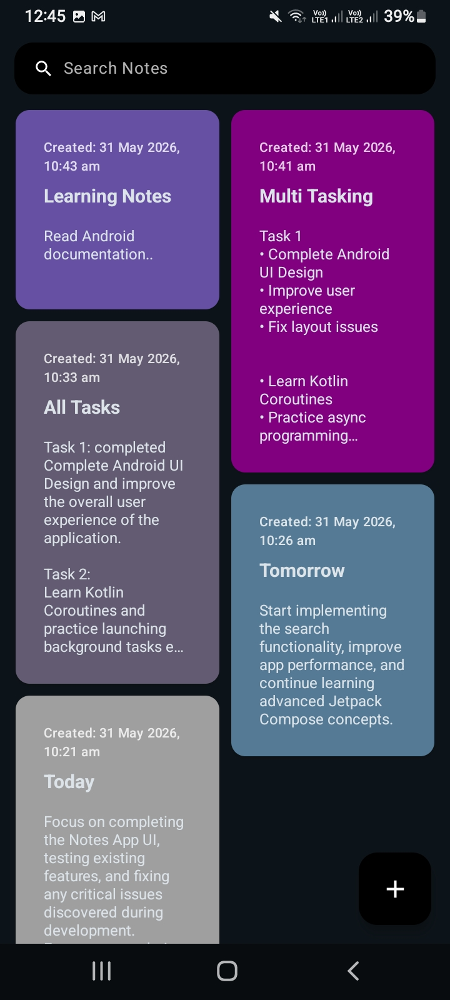
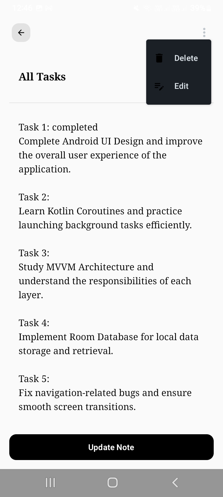
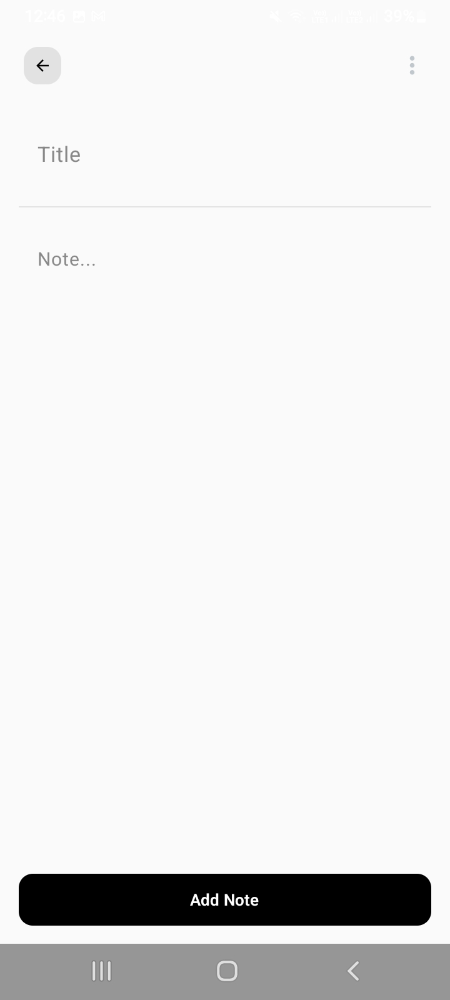

# 📝 NotesApp - Clean & Responsive Note Taking

Welcome to **NotesApp**, a modern, lightweight, and fully responsive Android application built to help you capture your thoughts instantly. This app is designed with a focus on simplicity, performance, and a beautiful user experience across all device sizes (Phones & Tablets).

---

## 🚀 Key Features

*   **✨ Seamless CRUD**: Create, Read, Update, and Delete notes with ease.
*   **🔍 Smart Search**: Instantly find any note using the optimized search bar.
*   **📱 Fully Responsive**: Custom layout logic that adapts beautifully to both mobile and tablet screens.
*   **🎨 Vibrant UI**: Notes are automatically assigned beautiful, randomized colors for a modern look.
*   **💾 Persistent Storage**: Powered by Room Database, ensuring your notes are safe even if you close the app.
*   **⚡ Modern Architecture**: Built using the latest Android development best practices.

---


## 🛠 Tech Stack

This project uses modern Android tools that developers use today:


*   **Kotlin**: 100% type-safe and modern programming language.
*   **Jetpack Compose**: Declarative UI framework for building native Android interfaces.
*   **Room DB**: Robust SQLite abstraction for local data persistence.
*   **MVVM Architecture**: Ensures clean code separation and maintainability.
*   *Asynchronous Logic**:[Coroutines & Flow] For efficient background processing and reactive UI updates.
*   **Gradle**: Reliable dependency management and build system.
---

## 📂 Project Structure

The project follows a clean, organized package structure:

```
com.example.notesapp
├── data
│   ├── local        # Room Database, DAO, and Entity (NotesData)
│   └── repository   # Bridge between Data Source and ViewModel
├── viewmodel        # Business logic and UI state management
├── ui
│   └── theme        # App styling (Color, Shape, Typography, Theme)
│       └── screens  # Responsive UI Components (MainScreen, NoteScreen)
└── util             # Helper classes (e.g., Color generation logic)
```


## 🔄 How it Connects (The Architecture)

1.  **UI Layer (MainScreen & NoteScreen)**: Collects the latest state from the ViewModel using `collectAsState`. It reacts instantly to any changes in the data.
2.  **ViewModel Layer (NotesViewModel)**: Acts as the brain. It handles user actions (like saving a note) and talks to the Repository using Coroutines.
3.  **Repository Layer (NoteRepository)**: The "Single Source of Truth." It manages the data flow between the ViewModel and the local database.
4.  **Data Layer (Room DB)**: Directly interacts with the SQLite database to save, delete, or fetch notes from the device storage.


## 📸 Screenshots
<p align="center">
  
  
  
</p>
 
## 🌟 Topics Covered in this Project

- **Jetpack Compose** (LazyVerticalStaggeredGrid, BoxWithConstraints, Scaffold)
- **Room Database** (Entity, DAO, Database Class)
- **State Management** (Flow, StateFlow, collectAsState)
- **MVVM Architecture**
- **Responsive UI Design** (Handling different screen widths)
- **Kotlin Coroutines** for background tasks


## Flow comp how the code work
  use app inspection to see sqlite database

dataclass -> dao crud operations add -> notedatabase -> repository -> viewmodel


## IMP CONCEPTS OR KEYWORDS
Entity → Table
DAO → Queries
Database → Connection Manager
Repository → Clean Access Layer
ViewModel → UI State
UI → Screen

Customer = ViewModel
Manager = Repository
Worker = DAO
Store = Database


❌ Tight coupling
Kotlin
Activity directly database se data le rahi hai
👉 Agar database change ho → app break

✅ Loose coupling
Kotlin
Activity → Repository → Database
👉 Activity ko nahi pata data kahan se aa raha hai
Sirf “data chahiye” ka kaam karti hai


## >>>>>viewmodel file explain<<<<<<<<<

.stateIn(viewModelScope, SharingStarted.WhileSubscribed(), emptyList())

.stateIn(viewmodelscope)
when ViewModel destroy:
ViewModel Cleared -> Coroutine Cancel -> Flow Stop -> Memory leak avoid

SharingStarted.WhileSubscribed()
>> flow active until any ui observed
>> Screen Open->Collect Start
>> Screen Close->Collect Stop
>>  Battery & resources save

emptyList()
before getting data from Database
notes.value -> contains:[] ..(empty list)

after

[
Note1,
Note2,
Note3
]


##  Migration in database comp concept explained
notes database sqlLite queries code concept explained also migration

migration use if we add data like in future will add color or time currect just title or data so
when we add new update in data
so to save the previous data of users we use migration for updated versions

1, 2     2,3    3,4
ROOM DATABASE MIGRATION (Version 2 to 3)
Migration is used to update the database structure without deleting existing user data.

val migration = object : Migration(2, 3) {
override fun migrate(db: SupportSQLiteDatabase) {

    db.execSQL(
        "ALTER TABLE notes ADD COLUMN color INTEGER NOT NULL DEFAULT 0"
    )

    db.execSQL(
        "ALTER TABLE notes ADD COLUMN timestamp INTEGER NOT NULL DEFAULT 0"
    )

    db.execSQL(
        "UPDATE notes SET timestamp = strftime('%s','now') WHERE timestamp = 0"
    )
}
}


1. Migration (2, 3)

* This means database is upgrading from version 2 to version 3.
* Room will automatically run this when app updates.


2. Add COLOR column
   SQL:
   ALTER TABLE notes ADD COLUMN color INTEGER NOT NULL DEFAULT 0

* Adds a new column called "color"
* Type is INTEGER (number)
* NOT NULL means value cannot be empty
* DEFAULT 0 means old notes will get value 0 automatically


3. Add TIMESTAMP column
   SQL:
   ALTER TABLE notes ADD COLUMN timestamp INTEGER NOT NULL DEFAULT 0

* Adds a new column called "timestamp"
* Stores time in number format (Unix time)
* Old notes will get default value 0

4. Update old notes timestamp
   SQL:
   UPDATE notes SET timestamp = strftime('%s','now') WHERE timestamp = 0

* Finds all notes where timestamp is 0
* Sets current time using Unix timestamp
* Fixes old data so every note has real time


WHY DEFAULT 0 IS IMPORTANT:
* Old database rows already exist
* Without DEFAULT value, app will crash
* DEFAULT 0 prevents errors during migration


FINAL RESULT:

Before:
id, title, content

After:
id, title, content, color, timestamp

Migration = safe database upgrade without deleting user data
